# Multi-Stage Amplifier & 555 Timing Circuits

Individual project for the "Laboratorio di elettronica per la robotica" course (University of Trento, Dept. of Industrial Engineering). Two independent analog design problems: a two-stage inverting amplifier with a low-pass filter and DC level shift, and a three-555 timing chain generating a delayed pulse on every clock edge.

**Author:** Michele Zanella — June 2026.

This is a design-and-measurement lab report: every stage was hand-calculated, simulated in TINA-TI, built on breadboard, and verified on the bench (oscilloscope + multimeter). No firmware or code is involved — the artifacts here are circuit designs and experimental results.

## Problem 1 — Multi-stage amplifier

**Specification:** given a 1.5–2.0 V source with 100 kΩ series resistance, design an inverting amplifier with 0–5 V output (±5%) and a 500 Hz ±10% low-pass response.

Required transformation: `Vout = -10·Vin + 20 V` — gain of 10 (inverting) plus a +20 V DC shift.

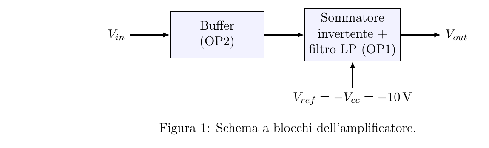

- **Stage 1 (OP2, unity-gain buffer):** isolates the 100 kΩ source impedance from the second stage.
- **Stage 2 (OP1, inverting summer + low-pass filter):** combines the buffered input with a fixed −10 V reference to realize the gain, the DC shift, and the 500 Hz pole (via a capacitor in parallel with the feedback resistor) all in one stage.

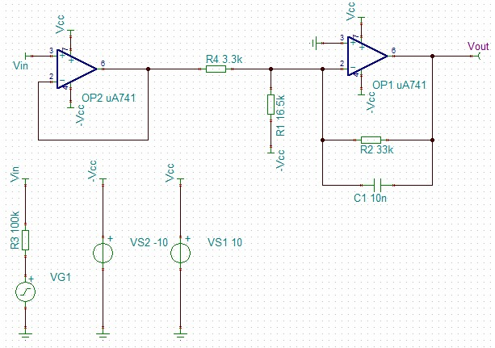

Component values: R2 = 33 kΩ, R4 = 3.3 kΩ, C1 = 10 nF (fc ≈ 482 Hz nominal), R1 = 16.5 kΩ realized with a trimmer for fine offset tuning. Both op-amps are µA741, ±10 V supply.

### Simulation (TINA-TI)

| DC characteristic | Bode plot |
|---|---|
| 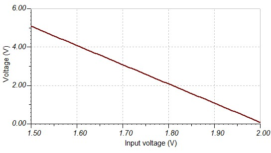 | 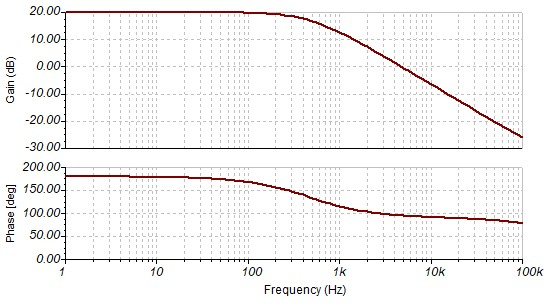 |

### Breadboard & measurements

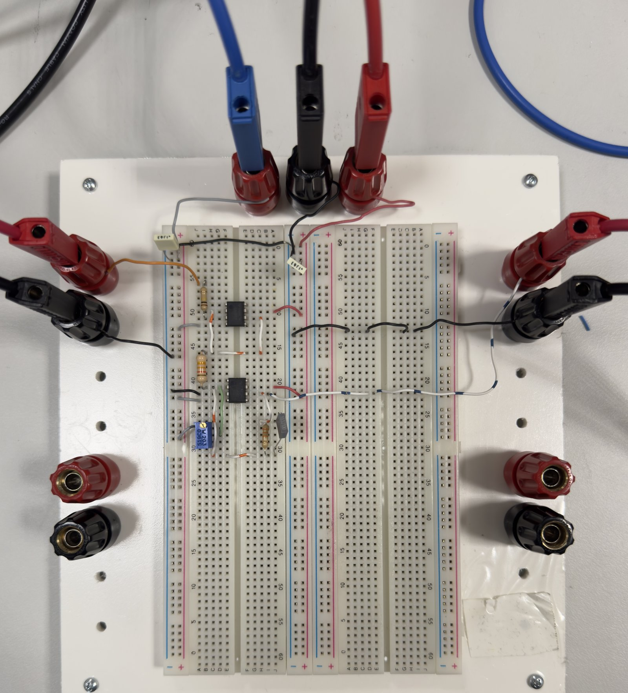

| Quantity | Target | Simulated | Measured |
|---|---|---|---|
| DC gain \|A_DC\| | 10 (20 dB) | 20 dB | 20 dB |
| Cutoff frequency fc | 500 Hz (±10%) | 478 Hz | 490 Hz |
| Phase at fc | 135° | 135° | 135.7° |
| Power consumption | — | — | 416 mW |

Transient response to a 25 µs / 0.5 V pulse (well inside the filter's ~318 µs time constant, so the output only partially settles before the pulse ends):

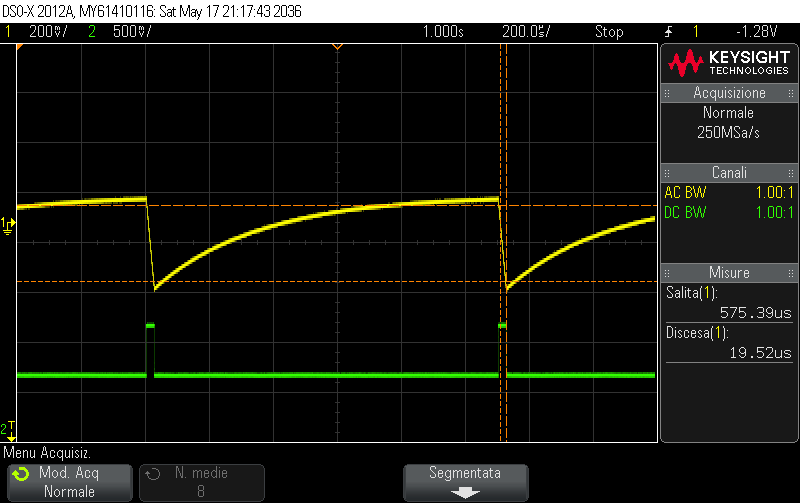

All specifications were met within the required ±5% tolerance.

## Problem 2 — Timing circuits

**Specification:** generate a 10 kHz, 20% duty-cycle clock, and on every rising edge, a 12.5 µs pulse delayed by 25 µs — both ±5% tolerance, VCC = 5 V.

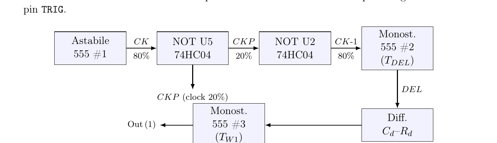

Three NE555 chips in cascade, plus two inverters (74HC04) to convert the astable's natural >50% duty cycle into the required 20% clock and to derive the correct trigger edge for the delay monostable:

1. **Astable (555 #1):** generates an 80%-duty internal clock; inverted by U5 to get the 20%-duty `CKP` clock; re-inverted by U2 to get the trigger signal `CK-1` for the next stage.
2. **Delay monostable (555 #2):** triggered by `CK-1`, produces the `TDEL = 25 µs` delay pulse.
3. **Pulse monostable (555 #3):** triggered via a `Cd`–`Rd` differentiator on the falling edge of the delay pulse, produces the `TW1 = 12.5 µs` output pulse.

| Astable (555 #1) | Delay monostable (555 #2) | Pulse monostable (555 #3) |
|---|---|---|
| 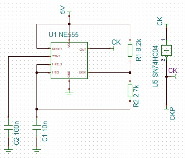 | 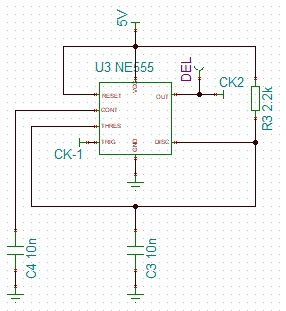 | 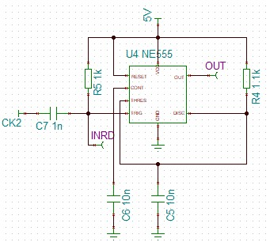 |

Component values: astable RA = 8.2 kΩ, RB = 2.7 kΩ; delay monostable RA = 2.2 kΩ; pulse monostable RA = 1.14 kΩ (trimmer); all timing capacitors C = 10 nF; differentiator Cd = 1 nF, Rd = 1 kΩ.

### Breadboard & measurements

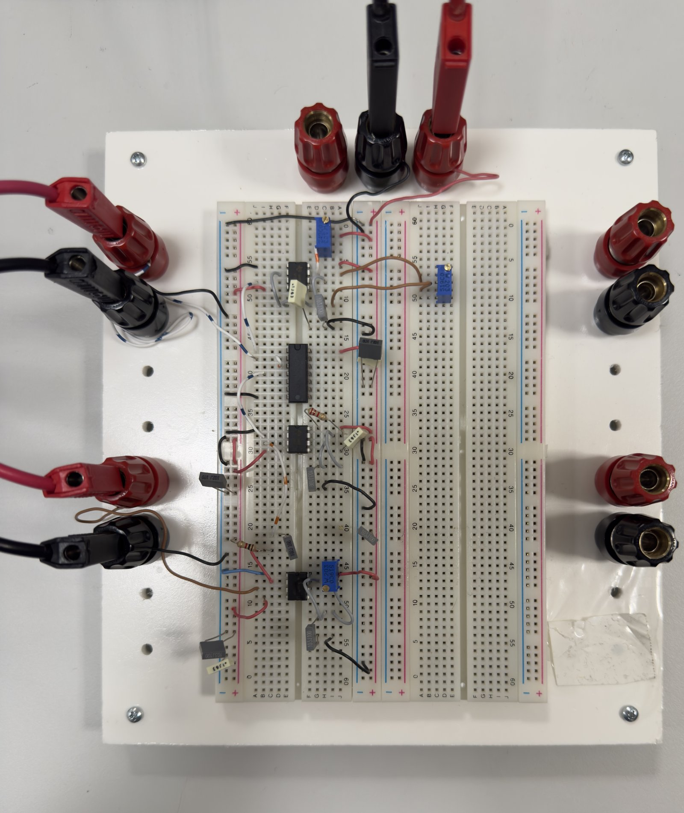

| Quantity | Target | Tolerance (±5%) | Simulated | Measured |
|---|---|---|---|---|
| Period T | 100 µs | 95–105 µs | 96.1 µs | 99.2 µs |
| Frequency f | 10 kHz | 9.5–10.5 kHz | 10.4 kHz | 10.08 kHz |
| Duty cycle | 20% | — | 20% | 20.1% |
| Delay TDEL | 25 µs | 23.75–26.25 µs | 24.49 µs | 25.0 µs |
| Pulse width TW1 | 12.5 µs | 11.875–13.125 µs | 12.63 µs | 12.6 µs |

Current consumption at steady state: 21.1 mA.

Clock `CK` (channel 1) and output pulse (channel 2) overlaid, showing the delay and pulse width:

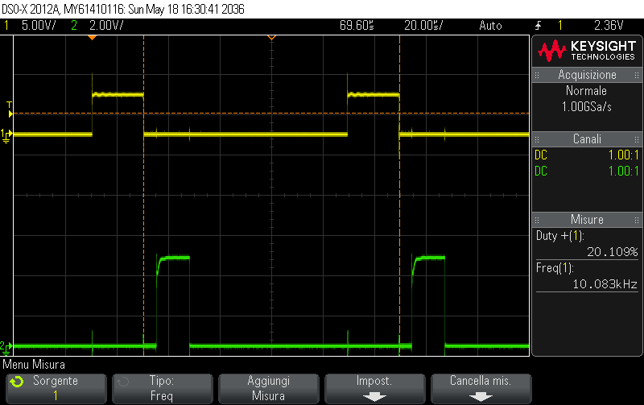

All timing specifications were met within the required ±5% tolerance.

## Notes

- The amplifier's transient response is dominated by the low-pass filter: with τ ≈ 318 µs roughly 13× longer than the 25 µs test pulse, the output only traverses ~7% of its full-scale swing — an expected consequence of the bandwidth/speed trade-off imposed by the spec.
- The astable's standard NE555 topology can only produce duty cycles above 50%; reaching the required 20% needed a deliberate two-inverter design (one to generate the 20% clock, a second to recover the correct trigger polarity for the next stage) rather than a single inversion.
- Full report (complete derivations, additional oscilloscope captures) available on request — this repository contains the circuit designs and key simulated/measured results.
